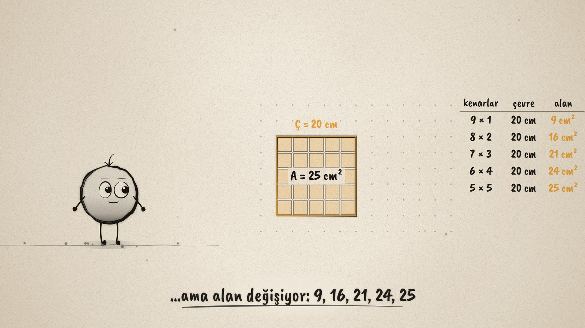
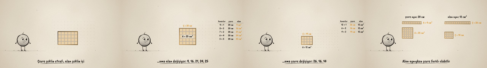

# Çevre mi, Alan mı? · Perimeter or Area?

**▶ Tarayıcıda izleyin / Watch in the browser:** https://hakanatas.github.io/cevre-mi-alan-mi/ 
**⬇ MP4 + altyazılar / MP4 + subtitles:** [Releases](https://github.com/hakanatas/cevre-mi-alan-mi/releases) 
**✎ Kullanılan istem / The prompt behind it:** [PROMPT.md](PROMPT.md) 
**🎞 Bütün filmler / All films:** [Nokta'nın Filmleri](https://hakanatas.github.io/nokta-filmleri/)

> **TR —** 5. sınıf matematik "Geometrik Nicelikler" temasındaki MAT.5.4.3 öğrenme çıktısı için hazırlanmış, tamamen JavaScript ile çizilen 92 saniyelik mürekkep animasyonu. Nokta 6 × 4'lük bir dikdörtgen çiziyor: çevresi 20 cm, alanı 24 cm². 20 cm'lik ip kaydırılarak 9 × 1, 8 × 2, 7 × 3, 6 × 4 ve 5 × 5 dikdörtgenleri yapılıyor: çevre hep 20 cm, alanlar 9, 16, 21, 24, 25 cm². Sonra 12 birim kare 12 × 1, 6 × 2, 4 × 3 olarak diziliyor: alan hep 12 cm², çevreler 26, 16, 14 cm. Film "çevre ve alan farklı ölçülerdir; birini bilmek ötekini söylemez" fikriyle bitiyor. Altyazılar Türkçe, İngilizce ya da ikisi birlikte seçilebilir.

A 92-second ink animation for **5th-grade maths**, drawn entirely with JavaScript on an HTML5 canvas. It is the third film of the *Geometrik Nicelikler* theme, after [Aynı Çevre](https://github.com/hakanatas/ayni-cevre) and [Birim Kareler](https://github.com/hakanatas/birim-kareler). Nokta, the ink character from [The Learning Ink](https://github.com/hakanatas/the-learning-ink), is the guide again.

## Learning outcome

MEB, Türkiye Yüzyılı Maarif Modeli, Ortaokul Matematik, 5th grade, "Geometrik Nicelikler" theme:

**MAT.5.4.3. Kenar uzunlukları doğal sayı olan bir dikdörtgenin alanının ölçüsü verildiğinde çevre uzunluğunu, çevre uzunluğu verildiğinde alanını yorumlayabilme**
- a) Given the area, it investigates the perimeter; given the perimeter, it investigates the area.
- b) It finds the perimeters of different rectangles with the same area, and the areas of different rectangles with the same perimeter.
- c) It explains that rectangles with the same perimeter can have different areas, and rectangles with the same area can have different perimeters.

## Scenes

| # | Time | Scene | What happens | Outcome |
|---|---|---|---|---|
| 1 | 0–10 s | Etrafı ve içi | Nokta draws a 6 × 4 rectangle. An amber rope goes around it (perimeter); unit squares fill it (area). | Intro |
| 2 | 10–24 s | İki ölçü | "Ç = 20 cm, A = 24 cm²". Guess: if the perimeter stays the same, does the area? | 5.4.3 a |
| 3 | 24–46 s | Aynı ip | The 20 cm rope slides: 9 × 1, 8 × 2, 7 × 3, 6 × 4, 5 × 5. A table fills in: perimeter always 20, areas 9, 16, 21, 24, 25. The biggest area is the square. | 5.4.3 a, b |
| 4 | 46–68 s | Aynı kareler | 12 unit squares are rearranged: 12 × 1, 6 × 2, 4 × 3. The area is always 12 cm², the perimeters are 26, 16, 14 cm. | 5.4.3 a, b |
| 5 | 68–80 s | Yan yana | Side by side: 9 × 1 and 5 × 5 (same perimeter, different areas); 12 × 1 and 4 × 3 (same area, different perimeters). | 5.4.3 c |
| 6 | 80–92 s | Aklında kalsın | "Çevre ve alan farklı ölçülerdir. Birini bilmek ötekini söylemez." Nokta celebrates. | Wrap-up |

## Running it

- **Preview:** double-click `index.html` (it works offline).
- **MP4:** run `npm install` once, then `npm run export -- --format=horizontal --captions=tr`.
- **Subtitles and narration:** `npm run srt` writes `out/captions_*.srt` and `narration_notes.txt`.
- **Editing:**
  - Caption text, timings and narration notes: `captions.js`
  - Scenes: `scenes/scene1.js` … `scene6.js` (shared parts, the table and the rope, are in `scene1.js`)
  - The rectangle's width over time (`W`, with height `10 − W`), unit squares (`unit`, `tiles`) and Nokta's poses: `src/draw/film.js`

It uses the same engine as The Learning Ink: `renderFrame(t)` as a pure function of time, seeded randomness, and frame-by-frame export.

## Lisans · License

**TR —** Bu film ve kodu [Creative Commons Atıf-GayriTicari 4.0 Uluslararası (CC BY-NC 4.0)](https://creativecommons.org/licenses/by-nc/4.0/deed.tr) lisansıyla paylaşılır. Ticari olmayan her amaçla (derste, okulda, eğitim materyalinde) kopyalayabilir, paylaşabilir ve değiştirebilirsiniz; ancak **kaynak göstermek zorunludur**: eser sahibinin adı ve bu deponun bağlantısı belirtilmeden kullanılamaz. Ticari kullanım (satış, ücretli ürün ya da yayın) için izin alınmalıdır.

**EN —** This film and its code are licensed under [Creative Commons Attribution-NonCommercial 4.0 International (CC BY-NC 4.0)](https://creativecommons.org/licenses/by-nc/4.0/). You may copy, share and adapt them for non-commercial purposes, but **attribution is required**: they may not be used without crediting the author and linking to this repository. Commercial use requires permission.

Atıf örneği / Required credit: *“Çevre mi, Alan mı?”, Hakan Ataş, Nokta'nın Filmleri — https://github.com/hakanatas/cevre-mi-alan-mi — CC BY-NC 4.0*
